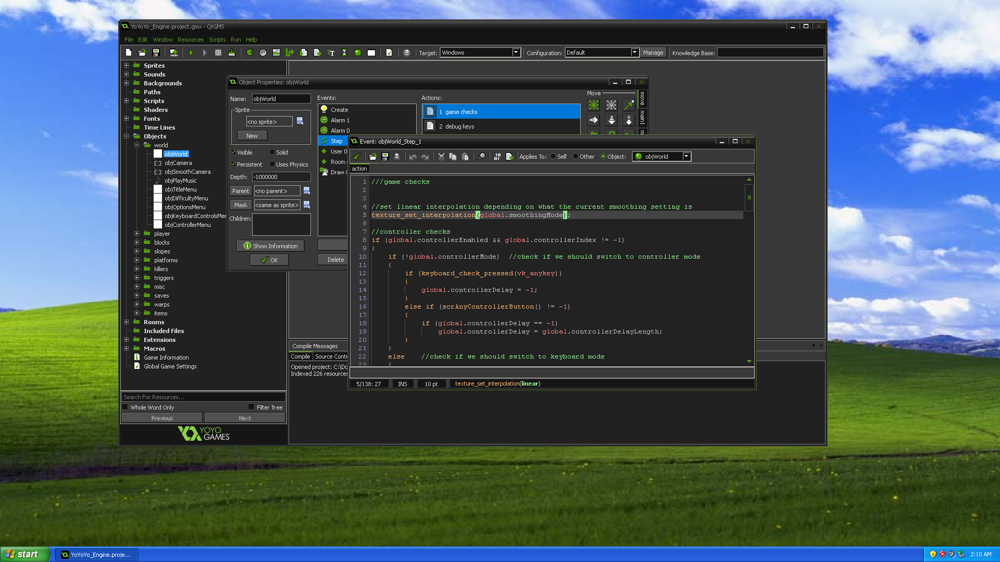

# QtGMS

A Qt rewrite of the **GameMaker: Studio 1.4.9999** editor.



## Highlights

- **Start creating immediately:** Double-click `QtGMS.exe` and start making your game—no project wizard required.
- **Familiar workflow:** Classic layouts, resource editors, menus, and shortcuts that feel at home to GameMaker Studio 1.4 users.
- **Legacy project import:** Import `.GMK`, `.GM81`, and `.GM82` projects and save them as GMX.
- **Fast compiler:** An efficient project compiler that caches converted assets to speed up subsequent builds.
- **Better code editing:** Smart indentation and fuzzy autocompletion for a smoother GML editing experience.
- **High-DPI support:** Scales with your display settings while keeping text crisp and clear.
- **Broad Windows compatibility:** Designed to run from **Windows XP to Windows 11**.

## Limitations

- Debugging is not yet supported.
- Compilation currently targets Windows only.
- Some advanced compiler features, such as SWF support, are not yet implemented.

If you need these features, you can switch back to the original GameMaker Studio 1.4 editor at any time.

## Importing projects

Use **File > Import Project** to import `.gmz`, GameMaker 7/8 `.gmk`,
GameMaker 8.1 `.gm81`, or GameMaker 8.2 `.gm82` files. Imported projects are temporary until you use
**Save As** to save them as GMX. Legacy extensions, triggers and functions removed
in GameMaker Studio may need manual changes. Import warnings appear in the compile panel.
For GMK files, choose the original project's text encoding when prompted (for example,
Shift-JIS / CP932 for Japanese projects). GM81 and GM82 files use UTF-8.

For GM82, select the `.gm82` file inside the project directory and keep its resource
folders alongside it. Resource groups, actions, room instances and tile transforms
are converted to GMX. Custom actions require their matching `.lib` files in QtGMS's
`lib` directory. GM82-specific runtime features and extensions may require manual
changes; importing does not replace the GMS runner with the GM82 runner.

## Building

Build on a modern Windows system using:

- Qt **5.6.3**, with the **MinGW 4.9.2 32-bit** kit (`mingw49_32`)
- MinGW **4.9.2 32-bit**
- CMake **3.21 or newer** and Ninja, both available on `PATH`

From the repository root, run these commands in PowerShell. Adjust the Qt and MinGW paths to match your installation:

```powershell
$env:QTGMS_QT_DIR = 'C:/Qt/Qt5.6.3/5.6.3/mingw49_32'
$env:QTGMS_MINGW_DIR = 'C:/Qt/Qt5.6.3/Tools/mingw492_32'

cmake --preset windows-xp
cmake --build --preset deploy-windows-xp --parallel 6
```

This builds the 32-bit Release version and copies the required runtime libraries and plugins beside `build/windows-xp/QtGMS.exe`.

To build and create a distributable ZIP instead, use PowerShell 5.1 or newer with the same environment variables:

```powershell
.\package.ps1 -Jobs 6
```

The archive is written to `build/packages/`.

## License

QtGMS's original code is licensed under the [MIT License](LICENSE).
Third-party libraries, assets, and bundled runtime components remain subject to their respective licenses and notices.
